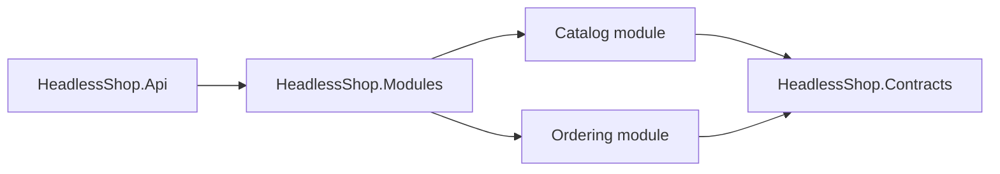

# Architecture

HeadlessShop is a modular monolith capability tour.

Catalog owns product creation. Ordering owns product snapshots and order placement. Catalog emits `ProductCreated` from the aggregate; the EF integration-event outbox enqueues it during the product transaction and Headless messaging dispatches it after commit. Ordering consumes that contract and updates its projection. The modules do not reference each other's internals.

The template disables the EF local-event processor because this tour uses integration events rather than in-process domain events. The integration-event processor remains enabled and writes through `AddIntegrationEventOutbox()`.

The generated app uses in-memory messaging transport and storage to keep the tour self-contained. Replace both with a durable provider before production use; in-memory storage cannot recover messages after process loss.

Tenant context is resolved from authenticated claims by `UseHeadlessTenancy()`. The generated fake authentication handler only honors headers in Development/Test and must be replaced before production use.

Local development uses fallback Headless encryption and hashing values. Non-Development hosts must configure `HeadlessShop:Encryption:DefaultPassPhrase`, `HeadlessShop:Encryption:DefaultSalt`, and `HeadlessShop:Hashing:DefaultSalt`.

OpenAPI and Scalar are mapped only in Development. Production hosts should expose API documentation behind their own authenticated operational boundary.
