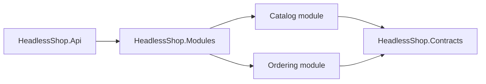

# Architecture

HeadlessShop is a modular monolith capability tour.

Catalog owns product creation. Ordering owns product snapshots and order placement. Catalog publishes `ProductCreated` explicitly through Headless messaging after the product save; Ordering consumes that contract and updates its projection. The modules do not reference each other's internals.

The template disables the generic EF lifecycle local-event processor in module DbContext registration because this tour uses explicit integration messages instead of local entity lifecycle handlers. Add an `IHeadlessMessageDispatcher` or re-enable the processor when your domain uses local or distributed entity messages.

Tenant context is resolved from authenticated claims by `UseHeadlessTenancy()`. The generated fake authentication handler only honors headers in Development/Test unless `HeadlessShop:AllowFakeTourAuth` is explicitly enabled, and it must be replaced before production use.

Local development uses fallback Headless encryption and hashing values. Non-Development hosts must configure `HeadlessShop:Encryption:DefaultPassPhrase`, `HeadlessShop:Encryption:DefaultSalt`, `HeadlessShop:Encryption:InitVector`, and `HeadlessShop:Hashing:DefaultSalt`.

OpenAPI and Scalar are mapped only in Development. Production hosts should expose API documentation behind their own authenticated operational boundary.
