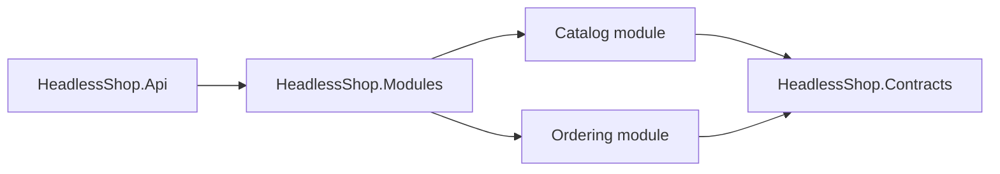

# Architecture

HeadlessShop is a modular monolith capability tour.

Catalog owns product creation. Ordering owns product snapshots and order placement. Catalog emits `ProductCreated` from the aggregate; the EF integration-event outbox enqueues it during the product transaction and Headless messaging dispatches it after commit. Ordering consumes that contract and updates its projection. The modules do not reference each other's internals.

The template disables the EF local-event processor because this tour uses integration events rather than in-process domain events. The integration-event processor remains enabled and writes through `AddIntegrationEventOutbox()`.

The generated app stores Catalog data, Ordering data, and Headless messaging records in PostgreSQL. Each module owns a schema and migration history. The message transport remains in-memory to keep the tour single-process, while the outbox itself survives process loss. Replace the transport with RabbitMQ, Kafka, or NATS before splitting modules or scaling the API horizontally.

Consumers must assume at-least-once delivery. `ProductCreatedConsumer` uses the product identifier as its natural idempotency key and updates the existing snapshot on replay. External side effects such as charging a card need a durable operation record keyed by the message or business identifier.

Persisted dispatch retries are bounded. Transient failures use the framework retry strategy; messages that exhaust the configured budget remain in PostgreSQL for diagnosis and recovery.

Tenant context is resolved from authenticated claims by `UseHeadlessTenancy()`. The generated fake authentication handler only honors headers in Development/Test and must be replaced before production use.

Local development uses fallback Headless encryption and hashing values. Non-Development hosts must configure `HeadlessShop:Encryption:DefaultPassPhrase`, `HeadlessShop:Encryption:DefaultSalt`, and `HeadlessShop:Hashing:DefaultSalt`.

OpenAPI and Scalar are mapped only in Development. Production hosts should expose API documentation behind their own authenticated operational boundary.

Local development starts PostgreSQL from `compose.yaml`. Integration tests use Testcontainers instead of sharing the developer database, so tests remain isolated and reproducible.
